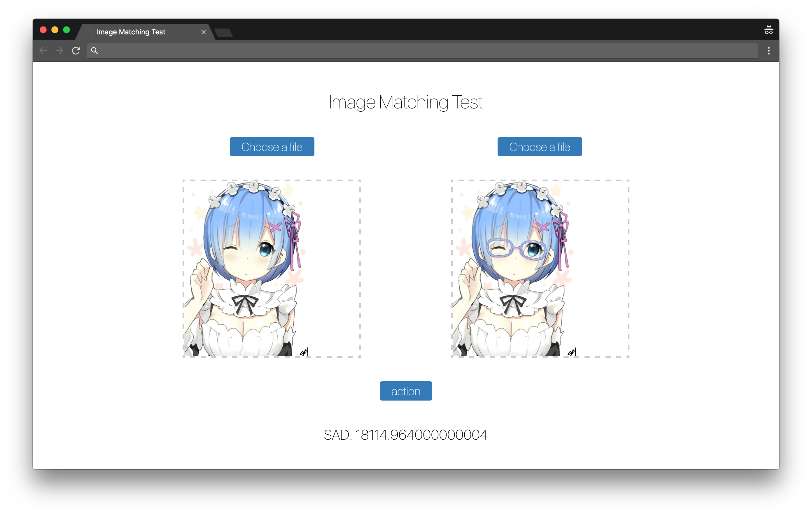

# Image-Match

Compare different images pixel by pixel.

[![NPM Version][npm-image]][npm-url]
[![NPM Downloads][downloads-image]][downloads-url]

## Demo

[http://geekplux.github.io/image-match](http://geekplux.github.io/image-match)

## Preview



## Installation

    $ npm install image-match

## Usage

import the `image-match.js` to your HTML.

```javascript

var similarity = imgMatch.compare(templateImg.src, matchImg.src, function (similarity) {
  console.log(similarity);
});

```

## License

MIT &copy; [GeekPlux](https://github.com/geekplux)


[npm-image]: https://img.shields.io/npm/v/image-match.svg
[npm-url]: https://npmjs.org/package/image-match
[downloads-image]: https://img.shields.io/npm/dm/image-match.svg
[downloads-url]: https://npmjs.org/package/image-match
